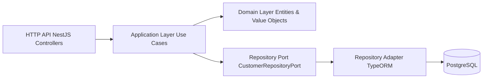
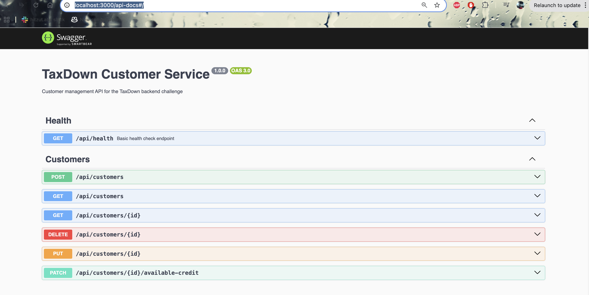
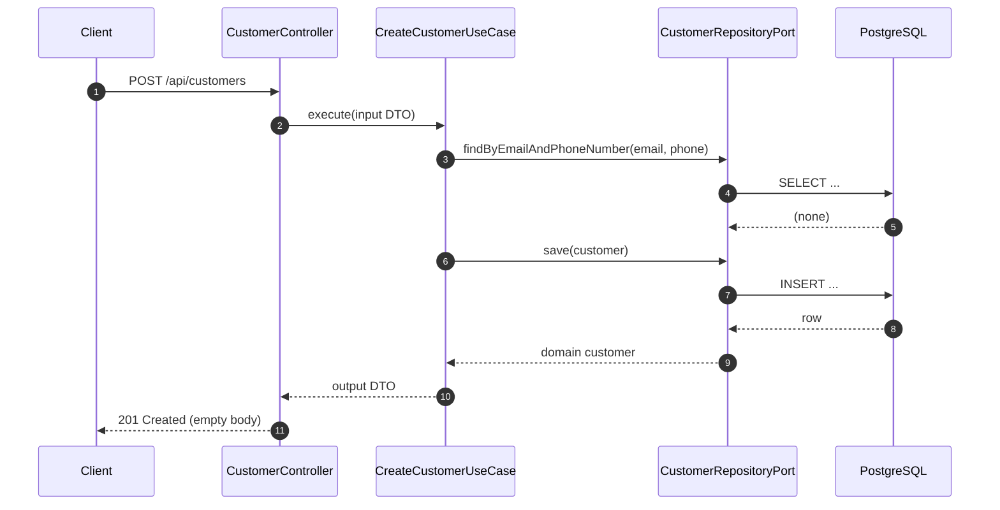

# ARCHITECTURE

This service is a small **Customer Management API** built as a **DDD + Hexagonal (Ports & Adapters)** NestJS application, deployed as a **single AWS Lambda** behind API Gateway (Serverless Framework).

## High-level dependency flow

## Folder / layer mapping

- **Domain**: `src/customer/domain/**`
  - Entity (aggregate root): `src/customer/domain/entities/customer.entity.ts`
  - Value Objects: `src/customer/domain/value-objects/*.ts`
  - Domain errors: `src/customer/domain/errors.ts`
  - Repository port: `src/customer/domain/ports/customer-repository.port.ts`
- **Application**: `src/customer/application/**`
  - Use cases: `src/customer/application/use-cases/*.ts`
  - Application DTOs: `src/customer/application/dto/**`
- **Infrastructure**: `src/customer/infrastructure/**`
  - HTTP adapter: `src/customer/infrastructure/http/**`
  - Persistence adapter (TypeORM): `src/customer/infrastructure/persistence/**`
- **Shared**: `src/shared/**`
  - TypeORM config + migrations: `src/shared/persistence/**`
  - Swagger: `src/shared/swagger.ts`

## Domain model (Customer aggregate)

### Customer

File: `src/customer/domain/entities/customer.entity.ts`

Key responsibilities:

- Validates invariants when creating/updating customer state.
- Encapsulates behavior like increasing available credit.

Relevant behaviors:

- `updateName(name)` rejects empty values (throws `CustomerNameEmptyError`)
- `increaseAvailableCredit(delta)` requires delta > 0 (throws `CustomerAvailableCreditPositiveError`)

### Value Objects (invariants)

Files: `src/customer/domain/value-objects/*.ts`

- `CustomerId`: must be a positive integer
- `Email`: must be a valid email
- `PhoneNumber`: must match the allowed phone pattern
- `AvailableCredit`: must be non-negative

### Domain errors

File: `src/customer/domain/errors.ts`

The domain expresses business rule violations as strongly-typed errors (e.g. `CustomerNotFoundError`, `CustomerAlreadyExistsEmailPhoneNumberError`).

## Application layer (use cases)

Use cases coordinate domain + persistence through the repository port.

Files: `src/customer/application/use-cases/*.ts`

Examples:

- `CreateCustomerUseCase`
  - Validates uniqueness via `CustomerRepositoryPort.findByEmailAndPhoneNumber(...)`
  - Creates a new `Customer` and persists it
- `FindAllCustomerUseCase`
  - Delegates pagination/sorting to the repository port
- `AddAvailableCreditCustomerUseCase`
  - Loads customer, applies `increaseAvailableCredit`, persists changes

## Ports & adapters

### Repository port

File: `src/customer/domain/ports/customer-repository.port.ts`

This interface is the boundary between application/domain and persistence concerns.

### TypeORM adapter

File: `src/customer/infrastructure/persistence/customer.repository.adapter.ts`

Implements the repository port using TypeORM:

- Uses a safelisted mapping for sorting keys (prevents SQL identifier injection)
- Implements **soft delete** via `repo.softDelete(...)`

### ORM entity mapping

File: `src/customer/infrastructure/persistence/customer.orm-entity.ts`

- Table: `customers`
- Unique index: `idx_unique_email_phone_number` on `(email, phone_number)`
- Maps ORM <-> domain via `toDomain(...)` and `fromDomain(...)`

## HTTP layer

Controllers:

- Customers: `src/customer/infrastructure/http/customer.controller.ts`
- Health: `src/health/health.controller.ts`

Global prefix:

- The app prefixes all routes with `/api` (see `src/main.ts` and `src/lambda.ts`)

Swagger:

- Setup: `src/shared/swagger.ts`
- UI path: `/api-docs`

## Lambda deployment model

Serverless config: `serverless.yml`

- Single function handler: `src/lambda.handler`
- API Gateway HTTP API proxy routes: `/` and `/{proxy+}`

## Sequence diagram (Create customer)

