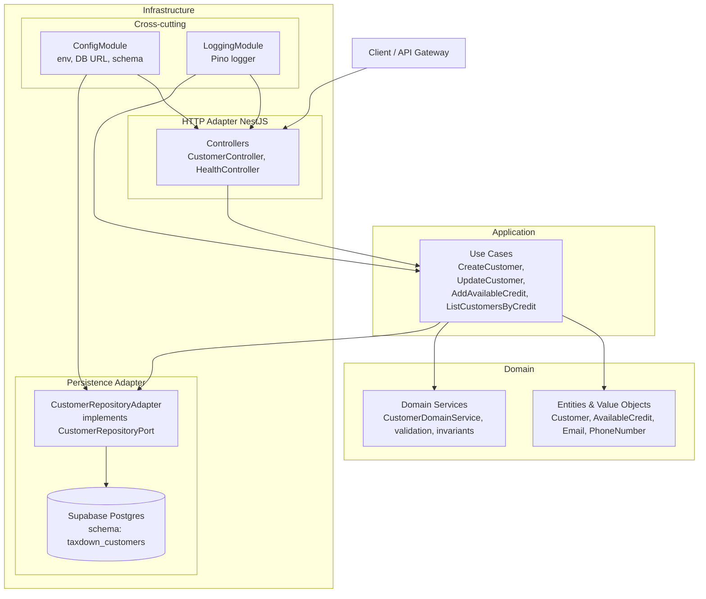

# Taxdown

## 1. Deployment model (Lambda)

The Lambda simply hosts the Nest HTTP application as **one cohesive unit**, which is a common and pragmatic pattern for small to medium backends and technical challenges.

---

## 2. Hexagonal architecture and the role of NestJS

At code level, the architecture follows a hexagonal style:



---

## 3. Configuration (env vars)

The app uses a validated configuration module (`src/shared/config`) and reads database settings from environment variables.

- **DB_URL**: primary Postgres connection string (use this for local docker-compose and future deployments)
- **DB_SCHEMA**: optional schema name (defaults to `public` if not set)

See `.env.example` for a working local configuration.

# Customer Domain & Use Cases Design

## 1. Purpose & Scope

This document defines the **domain model** and **core use cases** for the `Customer` bounded context in the **TaxDown Customer Service**.

The goal is to:

- Model the `Customer` entity as a **rich domain object**, not just a database row.
- Define the **business rules** and **invariants** around:
  - customer identity,
  - contact information,
  - available credit.
- Identify the **core use cases** required by the technical challenge:
  - CRUD over `Customer`,
  - a method to **add available credit**,
  - a method to **list all customers sorted by available credit**.
- Keep the domain model **independent** from:
  - HTTP (NestJS controllers),
  - persistence technology (TypeORM, Postgres),
  - infrastructure (AWS Lambda, Serverless Framework).

This design will guide the implementation of:

1. The **domain layer** (`src/customer/domain`).
2. The **application layer/use cases** (`src/customer/application`).
3. Later, the **infrastructure adapters** (HTTP, DB).

---

## 2. Requirements Mapping

### 2.1 From the challenge

The challenge states:

- Build a **REST API** for a `Customer` entity:
  - Perform full **CRUD**.
  - Provide a method to **add available credit** to a customer.
  - Provide a method to **list all customers sorted by available credit**.
- Use **Node.js + TypeScript**.
- They value:
  - SOLID
  - API Design
  - Testing
  - DDD
  - Hexagonal
  - Serverless

### 2.2 Functional requirements (for the domain)

From these, we derive the following **domain-level** functional requirements:

1. We must be able to **create** a new `Customer` with:

   - Name
   - Email
   - Phone number
   - Initial available credit (default 0)

2. We must be able to **read** a `Customer` by ID.

3. We must be able to **update**:

   - Customer name
   - Contact information (email, phone)

4. We must be able to **delete** a Customer (logical or physical; we will choose soft delete in persistence, but the domain can express “removed / no longer active”).

5. We must be able to **increase the available credit** of a Customer:

   - The delta must be positive.
   - The resulting credit must never be negative.

6. We must be able to **list all customers sorted by available credit** (descending).

---

## 3. Domain Boundary & Ubiquitous Language

### 3.1 Bounded Context: Customer Management

This service focuses on the **Customer Management** bounded context for an online motorbike shop. Within this context, we define the following terms:

- **Customer**: A registered person who can buy motorbikes and associated products.
- **Available Credit**: The amount of money the customer has available to use for purchases. Distinct from external credit lines, this is the “credit” we track inside our shop’s system.
- **Contact Information**: How we reach the customer:
  - Email
  - Phone number

Other concepts such as **Orders**, **Payments**, **Invoices**, etc. belong to other bounded contexts and are out of scope for this challenge.

---

## 4. Domain Model

The domain model is centered around the `Customer` aggregate root and several value objects.

### 4.1 Entities and Value Objects

We define:

- **Aggregate Root:**

  - `Customer`

- **Value Objects:**
  - `CustomerId`
  - `Email`
  - `PhoneNumber`
  - `AvailableCredit`

#### Customer (Aggregate Root)

**Responsibilities:**

- Represent a single customer in the system.
- Ensure invariants on:
  - Identity
  - Contact information
  - Available credit
- Expose behavior for:
  - Updating identity & contact data
  - Increasing available credit

**Attributes (domain view):**

- `id: CustomerId`
- `name: string`
- `email: Email`
- `phoneNumber: PhoneNumber`
- `availableCredit: AvailableCredit`
- `createdAt: Date`
- `updatedAt: Date`

**Domain invariants:**

- `name` must be non-empty.
- `email` must be valid.
- `phoneNumber` must be valid according to our rule.
- `availableCredit` must never be negative.

**Domain behaviors:**

- `updateName(name: string): void`
- `updateContact(email: Email, phoneNumber: PhoneNumber): void`
- `increaseAvailableCredit(delta: AvailableCredit): void`

These operations encapsulate the business rules and prevent arbitrary state changes.

#### Email (Value Object)

- Wraps a `string`.
- Validates format on creation.
- Throws a domain error on invalid format.
- Exposes `getValue(): string`.

Rationale: centralize email validation to avoid duplicates and inconsistent rules.

#### PhoneNumber (Value Object)

- Wraps a `string`.
- Applies a simple, documented rule (e.g. non-empty, contains digits, optional `+`, minimal length).
- Throws a domain error if obviously invalid.
- Exposes `getValue(): string`.

Rationale: even if we don’t implement complex formatting, we ensure at least a minimum standard and can easily evolve rules.

#### AvailableCredit (Value Object)

- Wraps a `number`.
- Must be **non-negative** (`>= 0`).
- Exposes:
  - `getValue(): number`
  - `add(delta: AvailableCredit): AvailableCredit`

Rationale: available credit is central in the challenge, and modeling it as a VO makes it easy to enforce invariant “no negative credit” in a single place.

---

## 5. Application Layer: Use Cases

The **application layer** orchestrates domain operations and coordinates persistence via ports. It does not know about HTTP or TypeORM.

We define the following use cases:

### 5.1 CreateCustomerUseCase

**Input:**

- `name: string`
- `email: string`
- `phoneNumber: string`
- (optional) `availableCredit: number` (default 0)

**Process:**

1. Create `Email`, `PhoneNumber`, `AvailableCredit` VOs.
2. Instantiate a new `Customer` aggregate.
3. Persist via `CustomerRepositoryPort.save(customer)`.

**Output:**

- The created `Customer` (or a DTO representation).

---

### 5.2 GetCustomerByIdUseCase

**Input:**

- `id: number` (wrapped as `CustomerId`).

**Process:**

1. Call `CustomerRepositoryPort.findById(customerId)`.
2. If not found, throw a “Not Found” application error.

**Output:**

- The `Customer` (or DTO).

---

### 5.3 UpdateCustomerUseCase

**Input:**

- `id: number`
- Optional fields:
  - `name?: string`
  - `email?: string`
  - `phoneNumber?: string`

**Process:**

1. Load customer by id via repository.
2. Apply updates:
   - If `name` provided → `customer.updateName(name)`.
   - If `email` or `phoneNumber` provided → build new VOs and call `updateContact`.
3. Save updated customer.

**Output:**

- The updated `Customer`.

---

### 5.4 DeleteCustomerUseCase

**Input:**

- `id: number`.

**Process:**

1. Load customer by id.
2. Instruct repository to delete (soft delete in persistence).
   - Application layer doesn’t need to know if it’s soft or hard delete; repository implementation decides.

**Output:**

- No content (or a confirmation DTO).

---

### 5.5 AddAvailableCreditUseCase

**Input:**

- `id: number`
- `amount: number`

**Process:**

1. Validate that `amount > 0`.
2. Load customer by id.
3. Wrap `amount` in `AvailableCredit` VO (delta).
4. Call `customer.increaseAvailableCredit(delta)`.
5. Save updated customer.

**Output:**

- The updated `Customer` (or a DTO with new credit).

---

### 5.6 ListCustomersSortedByCreditUseCase

**Input:**

- (Optional) Pagination/filtering parameters (for the challenge we can start with “no filters”).

**Process:**

1. Call `CustomerRepositoryPort.findAllSortedByAvailableCredit()`.
2. Return customers sorted descending by available credit.

**Output:**

- List of customers (DTOs) sorted by `availableCredit` descending.

---

## 6. Ports & Adapters

### 6.1 Repository Port

For the domain and application layers, we define a **repository interface** (port):

```ts
export interface CustomerRepositoryPort {
  findById(id: CustomerId): Promise<Customer | null>;
  findAllSortedByAvailableCredit(): Promise<Customer[]>;
  save(customer: Customer): Promise<Customer>;
  delete(id: CustomerId): Promise<void>;
}


The domain/application layer depends on this interface.

The infrastructure layer (TypeORM + Postgres) will provide an adapter that implements this port.

6.2 HTTP & DB (out of scope for this doc)

HTTP controllers will live in src/customer/infrastructure/http, using NestJS.

TypeORM entities and migrations will live in src/customer/infrastructure/persistence and src/shared/persistence.

This document focuses on what needs to happen (domain + use cases), not on how HTTP or DB are implemented.

7. Error Handling Strategy (Domain & Application)

Domain errors:

Invalid email, phone, or credit should throw specific errors (could be custom error classes or standard Error with clear messages).

These are usually programming/validation errors; they will later be mapped to 400 Bad Request at HTTP level.

Application errors:

“Customer not found” → custom CustomerNotFoundError.

These will later map to 404 Not Found.

The domain and application layers should not know about HTTP status codes; they simply raise meaningful exceptions.

8. Testing Strategy for This Step

We want to show that “we LOVE testing”, as the challenge says.

8.1 Domain Tests

Customer entity tests:

Creating a valid customer.

Failing on invalid name/email/phone/credit.

increaseAvailableCredit works as expected, without allowing negative results.

Email VO tests.

PhoneNumber VO tests.

AvailableCredit VO tests.

8.2 Use Case Tests

CreateCustomerUseCase:

Creates a customer with valid data.

Fails when name/email/phone is invalid.

Interacts correctly with repository port (mocked).

AddAvailableCreditUseCase:

Increases credit by a positive amount.

Fails on zero or negative amount.

Fails when customer not found.

ListCustomersSortedByCreditUseCase:

Returns customers in correct order, using a mocked repository that returns a known list.

All use case tests should:

Use mocked implementations of CustomerRepositoryPort.

Not depend on HTTP or DB.

9. Implementation Plan (Step-by-step)

Create domain types:

Customer entity.

CustomerId, Email, PhoneNumber, AvailableCredit VOs.

CustomerRepositoryPort interface.

Write domain unit tests for the above.

Implement application use cases:

CreateCustomerUseCase

GetCustomerByIdUseCase

UpdateCustomerUseCase

DeleteCustomerUseCase

AddAvailableCreditUseCase

ListCustomersSortedByCreditUseCase

Write application tests:

Mocked CustomerRepositoryPort.

Validate behavior and interactions.

Only after this domain/application layer is solid:

Implement TypeORM adapter for CustomerRepositoryPort.

Implement NestJS controllers and DTOs.

Wire everything in CustomerModule.

10. Summary

This design:

Aligns directly with the challenge requirements (CRUD, credit, sorting).

Makes Customer a rich aggregate, not an anemic model.

Leverages Value Objects to encapsulate rules (email, phone, credit).

Uses a repository port to keep domain/application independent from persistence.

Defines use cases in the application layer to coordinate domain operations.

Is highly testable, allowing us to show unit tests for both domain and use cases.

The next implementation step is to:

Implement the domain types (Customer, VOs, repository port) and their unit tests, following this design.
```
