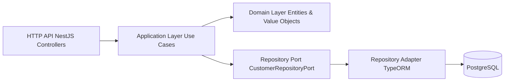
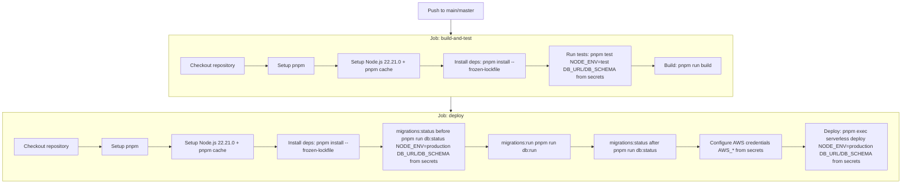

# TaxDown Customer Service

Customer Management REST API for the **TaxDown senior backend challenge**, built with **Node.js + TypeScript (NestJS)** using **DDD + Hexagonal architecture**. It’s deployed as a **single AWS Lambda behind API Gateway** (Serverless Framework) and uses **PostgreSQL + TypeORM**.

## About the Challenge (short)

Build a Customer API with:

- CRUD for a “Customer” entity
- A dedicated endpoint to **add available credit**
- A listing endpoint that supports **sorting by available credit**

The challenge emphasizes best practices (SOLID), testing, DDD/hexagonal design, and serverless deployment.

## Live API

- **Base URL**: `https://8gw9k7t2a3.execute-api.us-east-2.amazonaws.com`
- **Example**: `GET /api/health`

Note: this runs on AWS Lambda; **cold starts / free-tier constraints** may add a small delay on the first request.

Example:

```bash
curl -s "https://8gw9k7t2a3.execute-api.us-east-2.amazonaws.com/api/health"
```

## Quickstart (Local Development)

### 1) Clone & install

```bash
git clone https://github.com/hitzu/taxdown-tech-challenge
cd taxdown
```

```bash
pnpm install
```

### 2) Start PostgreSQL (dev + test)

```bash
docker compose up -d
```

This starts:

- **Dev DB**: `localhost:5432` (database: `taxdown`)
- **Test DB**: `localhost:5433` (database: `taxdown_test`)

### 3) Set environment variables

For local development and tests, copy the example env file and create the two env files used by this repo:

```bash
cp .env.example .env.local
cp .env.example .env.test
```

Then edit `.env.local` (dev DB, port 5432) and `.env.test` (test DB, port 5433) with the correct values for `DB_URL` and `DB_SCHEMA`.

### 4) Run migrations (dev DB)

```bash
pnpm db:run
```

### 5) Start the API

Recommended (Nest dev server):

```bash
pnpm dev
```

Alternative (Lambda-style local emulation):

```bash
pnpm offline
```

### 6) Verify

- `GET http://localhost:3000/api/health`
- `GET http://localhost:3000/api/customers`
- Swagger UI: `http://localhost:3000/api-docs`

## Architecture (very short)

This service follows **DDD + Hexagonal architecture**: HTTP controllers call **use cases** (application layer), which orchestrate **domain entities/value-objects** and use a **repository port** implemented by a TypeORM adapter.

- `src/customer/domain/**` (entities, value objects, domain errors, ports)
- `src/customer/application/**` (use cases, application DTOs)
- `src/customer/infrastructure/**` (HTTP controllers/DTOs/pipes, TypeORM adapter)
- `src/shared/**` (config, persistence, logging, swagger)

High-level flow:



See **`ARCHITECTURE.md`** for the detailed breakdown.

## API Overview

| Method | Path                                  | Result        |
| ------ | ------------------------------------- | ------------- |
| POST   | `/api/customers`                      | `201`         |
| GET    | `/api/customers/:id`                  | `200` / `404` |
| GET    | `/api/customers`                      | `200`         |
| PUT    | `/api/customers/:id`                  | `204` / `404` |
| PATCH  | `/api/customers/:id/available-credit` | `204` / `404` |
| DELETE | `/api/customers/:id`                  | `204` / `404` |
| GET    | `/api/health`                         | `200`         |

See **`API_REFERENCE.md`** for DTOs, validation rules, response bodies, and error scenarios.

## Testing & Quality

This repo includes multiple testing layers:

- **Domain tests** (entity + value object invariants)
- **Application/use-case tests** (with an in-memory repository)
- **Integration tests** (TypeORM + Postgres)
- **E2E tests** (full Nest app over HTTP via `supertest`)

Commands:

- `pnpm test` (unit + integration; excludes `*.e2e.spec.ts`)
- `pnpm test:e2e` (e2e only)
- `pnpm test:all` (everything)

**Husky pre-push hook**: `.husky/pre-push` runs **`pnpm test:all`** (including E2E) before allowing a push.

See **`TESTING.md`** for details (DB setup, Jest global setup/cleanup, CI vs local).

## CI/CD

GitHub Actions workflow: `.github/workflows/ci-cd.yml`  
Actions UI: `https://github.com/hitzu/taxdown-tech-challenge/actions`

- On **push/PR** to `main`/`master`, CI installs dependencies, runs `pnpm test`, and builds.
- **E2E tests are not run in CI** (no dedicated AWS test environment yet); they’re enforced locally via the **Husky pre-push** hook.
- On **push** to `main`/`master`, CI also runs DB migrations and deploys the Lambda using Serverless.



## Further documentation

- `ARCHITECTURE.md`
- `API_REFERENCE.md`
- `TESTING.md`
