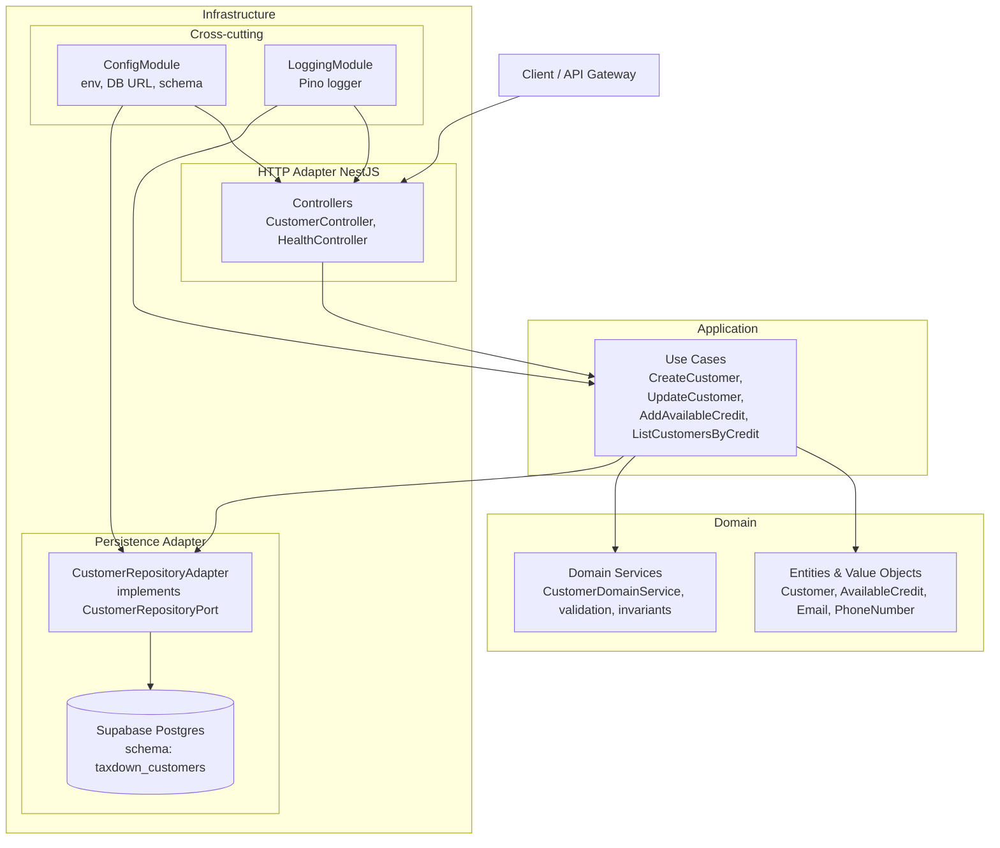

# Taxdown

## 1. Deployment model (Lambda)

The Lambda simply hosts the Nest HTTP application as **one cohesive unit**, which is a common and pragmatic pattern for small to medium backends and technical challenges.

---

## 2. Hexagonal architecture and the role of NestJS

At code level, the architecture follows a hexagonal style:

---

## 3. Configuration (env vars)

The app uses a validated configuration module (`src/shared/config`) and reads database settings from environment variables.

- **DB_URL**: primary Postgres connection string (use this for local docker-compose and future deployments)
- **DB_SCHEMA**: optional schema name (defaults to `public` if not set)

See `.env.example` for a working local configuration.
